PostgreSQL Documentation

Table of Contents

1.  Introduction

-   Overview of PostgreSQL

-   Key Features

2.  Installation

-   System Requirements

-   Download and Install PostgreSQL

-   Configuration Options

3.  Getting Started

-   Connecting to PostgreSQL

-   Creating a Database

-   Creating Tables

-   Basic SQL Commands

4.  Data Types

-   Numeric Types

-   Character Types

-   Date and Time Types

-   Composite Type

-   Custom Types

5.  Queries and Joins

-   SELECT Statement

-   WHERE Clause

-   JOIN Operations (INNER, LEFT, RIGHT, FULL)

-   GROUP BY and HAVING

6.  Indexes and Optimization

-   Creating Indexes

-   Query Optimization Techniques

-   EXPLAIN Statement

7.  Transactions

-   ACID Properties

-   BEGIN, COMMIT, ROLLBACK Statements

-   Savepoints

8.  Security

-   Authentication Methods

-   User and Role Management

-   Permissions and Privileges

9.  Backup and Restore

-   pg_dump and pg_restore

-   Continuous Archiving and Point-in-Time Recovery

10. Replication

-   Streaming Replication

-   Logical Replication

11. High Availability

-   Connection Pooling

-   Failover Strategies

12. Advanced Features

-   Triggers and Rules

-   Stored Procedures and Functions

-   Views

-   Full-Text Search

13. Extensions

-   Overview of Extensions

-   Installing and Managing Extensions

14. Tools and Utilities

-   pgAdmin (Graphical Administration Tool)

-   psql (Command-Line Interface)

-   Other Third-Party Tools

15. Troubleshooting

-   Common Issues and Solutions

-   Error Codes and Messages

-   Logging and Monitoring

16. Community and Resources

-   PostgreSQL Community

-   Online Documentation and Manuals

-   Forums and Mailing Lists

17. Best Practices

-   Database Design Best Practices

-   SQL Coding Standards

-   Performance Optimization Tips

**[Overview of PostgreSQL]{.underline}**

-   PostgreSQL, often referred to as \"Postgres,\" is a powerful and
    open-source relational database management system (RDBMS). It is
    designed to store and manage large amounts of data securely and
    efficiently.

-   PostgreSQL is free and open-source, which means anyone can use,
    modify, and distribute it. This encourages a combined community
    contributing to its continuous improvement.

-   It follows the relational model, organizing data into tables with
    rows and columns. This setup helps connect different pieces of
    information easily.

-   PostgreSQL follows ACID principles(Atomicity, Consistency,
    Isolation, Durability) making sure that transactions are dependable
    and keep the database secure, even when there are errors or system
    failures.

-   PostgreSQL is powerful because users can easily customize it to fit
    their specific needs. They can define their data types, operators,
    and functions, making it flexible for different applications.

-   PostgreSQL uses MVCC to manage many transactions happening at the
    same time. This makes sure that many users can work with and change
    data at the same time without any problems.

**[Key Features]{.underline}**

**Advanced Data Types:**

PostgreSQL can handle many different types of data, like arrays,
key-value pairs (hstore), JSON, and custom types. This makes it easy to
store and get different kinds of information efficiently.

**Extensive Indexing:**

PostgreSQL has different ways to organize data for quick searching, like
B-trees, hash indexes, and full-text indexes. Good indexing makes
searching for information faster, especially when dealing with lots of
data.

**Robust Transaction Support:**

PostgreSQL makes sure transactions are reliable by sticking to ACID
rules. This is good for applications where keeping data safe and correct
is really important.

**Scalability:**

PostgreSQL is made to handle more work in two ways: by adding more
servers sideways (horizontal scaling) or by making the current server
work better (vertical scaling).

**Foreign Data Wrappers (FDW):**

PostgreSQL helps you connect to and ask questions about data in other
databases or external sources easily. This is useful when data is spread
across many systems.

**Active Community and Support:**

PostgreSQL has a lively community of people who make the software
better. They regularly update it, fix bugs, and add new features. This
helps ensure that PostgreSQL remains a reliable and always improving
database system.

**[Installation]{.underline}**

Installing PostgreSQL involves a few steps to ensure a smooth setup.

**System Requirements**

Before installing PostgreSQL make sure your system meets the following
requirements:

-   **Operating System:** PostgreSQL supports various operating systems,
    including Windows, macOS, and various flavors of Linux (e.g.,
    Ubuntu, CentOS).

-   **Processor:** A modern processor capable of handling the expected
    workload.

-   **RAM:** A minimum of 1 GB RAM is recommended, but more is better,
    especially for handling larger databases.

-   **Disk Space:** Allocate at least 100 MB for the PostgreSQL binaries
    and libraries. Additional space is required for your databases.

**[Download and Install PostgreSQL]{.underline}**

**[Windows:]{.underline}**

1.  Visit the official PostgreSQL download page

(https://www.postgresql.org/download/windows/).

2.  Download the installer suitable for your architecture (32-bit or
    64-bit).

3.  Run the installer and follow the on-screen instructions.

4.  During installation, you will be prompted to set a password for the
    default database superuser.

**[macOS:]{.underline}**

Use Homebrew to install PostgreSQL:

-   brew install postgresql

**Linux (Ubuntu):**

1.  Update the package list: sudo apt-get update

> 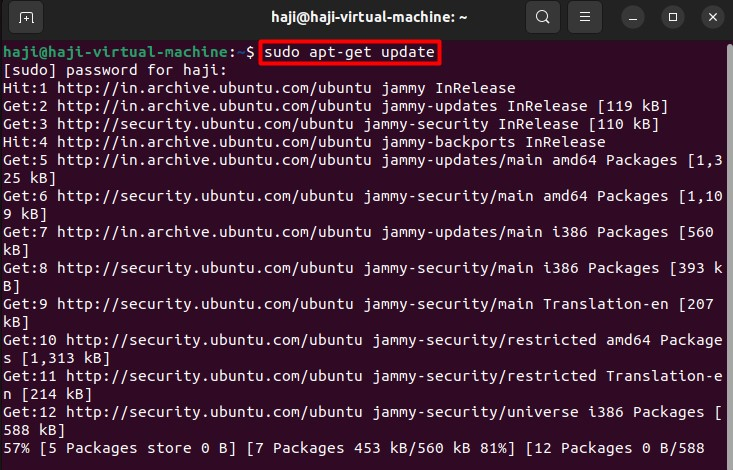{width="6.268055555555556in"
> height="4.023611111111111in"}

2\. Install PostgreSQL: sudo apt-get install postgresql

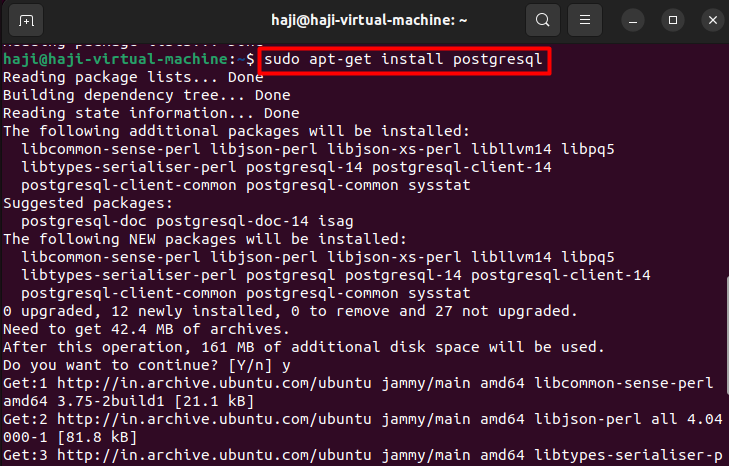{width="6.268055555555556in"
height="4.006944444444445in"}

**[Connecting to PostgreSQL]{.underline}**

To connect to PostgreSQL, you can use the \`psql\` command-line tool or
a graphical client like pgAdmin.

psql -h localhost -U your_username -d your_database

-   \`-h\`: Hostname, specify the server\'s address.

-   \`-U\`: User, provide your PostgreSQL username.

-   \`-d\`: Database, specify the name of the database you want to
    connect to.

You\'ll be prompted to enter your password. If you\'re connecting
locally and using the default settings, you might not need to provide a
password.

**[Creating a Database]{.underline}**

To create a new database, you can use the SQL command within \`psql\`.

SQL Command: CREATE DATABASE your_database;

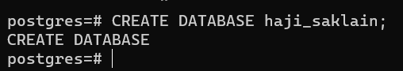{width="4.233333333333333in"
height="0.75in"}

**[Creating Tables]{.underline}**

Creating tables involves defining the structure of your data by
specifying columns, data types, and constraints.

CREATE TABLE employees (id serial PRIMARY KEY, name VARCHAR(100), salary
DECIMAL(10, 2));

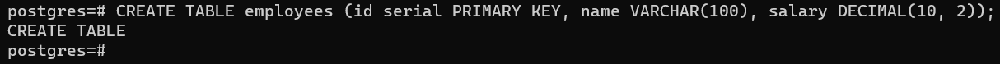{width="6.268055555555556in"
height="0.625in"}

-   \`id\`: Auto-incrementing primary key.

-   \`name\`: Variable character column for the employee\'s name.

-   \`salary\`: Decimal column for the employee\'s salary.

**[Basic SQL Commands]{.underline}**

**SELECT Statement:**

Retrieve all columns from the employees table++

SELECT \* FROM employees;

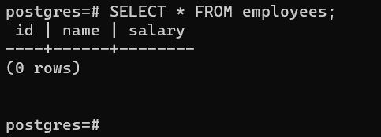{width="4.025in"
height="1.0916666666666666in"}

**Retrieve specific columns**

SELECT name, salary FROM employees;

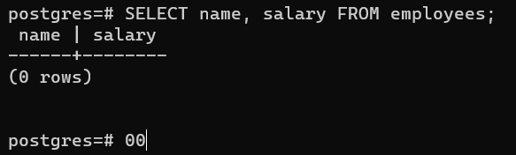{width="5.031844925634296in"
height="1.2083333333333333in"}

**INSERT Statement:**

INSERT INTO employees (name, salary) VALUES (\'John Doe\', 60000.00);

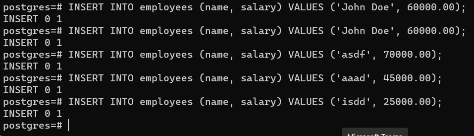{width="6.268055555555556in"
height="1.8076388888888888in"}

**Filter results with a condition**

SELECT \* FROM employees WHERE salary \> 50000;

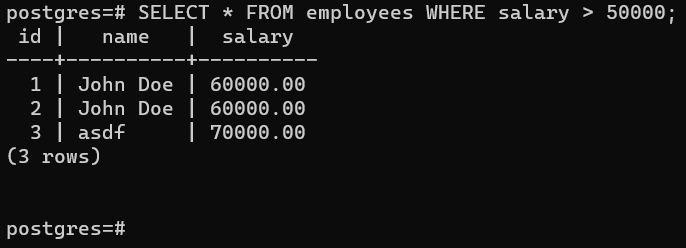{width="5.716666666666667in"
height="1.4916666666666667in"}

**UPDATE Statement:**

UPDATE employees SET salary = 65000.00 WHERE name = \'John Doe\';

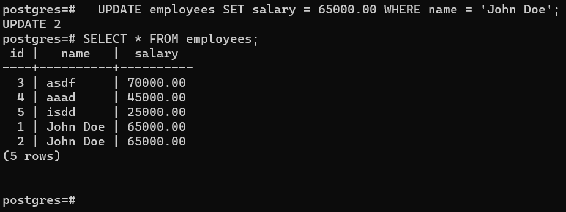{width="6.268055555555556in"
height="1.8916666666666666in"}

**DELETE Statement:**

DELETE FROM employees WHERE name = \'John Doe\';

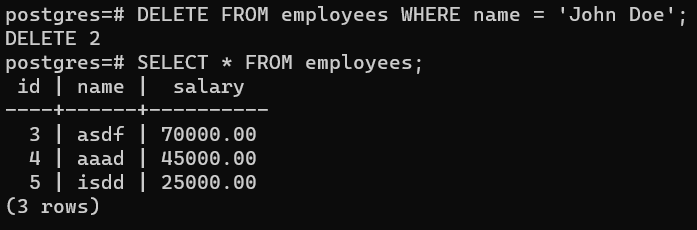{width="5.808333333333334in"
height="1.9166666666666667in"}

**[Data Types]{.underline}**

In PostgreSQL, there are various data types that you can use to define
the characteristics of columns in your tables.

**Numeric Types:**

PostgreSQL supports various numeric types, including \`INTEGER\`,
\`DECIMAL\`, \`NUMERIC\`, \`REAL\`, and \`DOUBLE PRECISION\`.

CREATE TABLE numeric_example (integer_column INTEGER, decimal_column
DECIMAL(10, 2), real_column REAL, double_precision_column DOUBLE
PRECISION);

INSERT INTO numeric_example VALUES (123, 456.78, 789.01, 1234.5678);

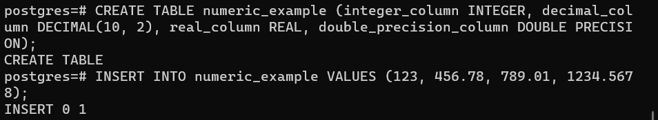{width="6.268055555555556in"
height="1.15in"}

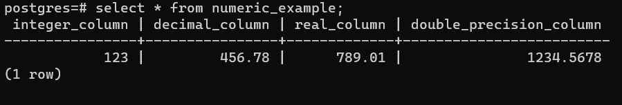{width="6.268055555555556in"
height="1.0597222222222222in"}

**Character Types:**

Character types include \`CHAR\`, \`VARCHAR\`, and \`TEXT\`

CREATE TABLE character_example (char_column CHAR(10), varchar_column
VARCHAR(255), text_column TEXT);

INSERT INTO character_example VALUES (\'abc\', \'abcdefg\',
\'abcdefghijklmnopqrstuvwxyz\');

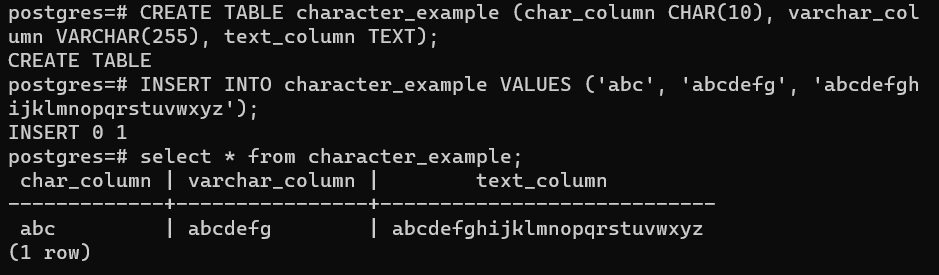{width="6.268055555555556in"
height="1.8354166666666667in"}

**Date and Time Types:**

PostgreSQL provides several date and time types, including \`DATE\`,
\`TIME\`, \`TIMESTAMP\`, and \`INTERVAL\`

CREATE TABLE date_time_example (date_column DATE, time_column TIME,
timestamp_column TIMESTAMP, interval_column INTERVAL);

INSERT INTO date_time_example VALUES (\'2024-02-01\', \'12:30:00\',
\'2024-02-01 12:30:00\', \'1 day 2 hours\');

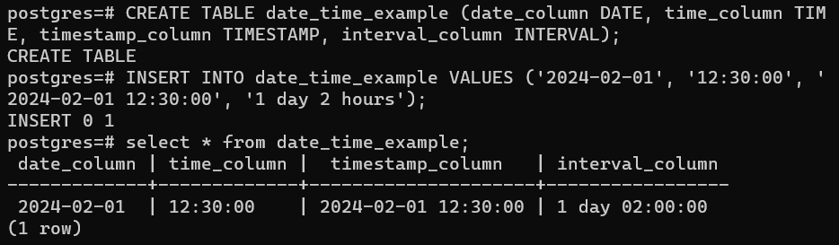{width="6.268055555555556in"
height="1.8319444444444444in"}

**Composite Type:**

A composite type is a custom type composed of multiple fields. Example:

CREATE TYPE my_address_type AS (street VARCHAR(255), city VARCHAR(100),
zip_code VARCHAR(10));

CREATE TABLE person (id SERIAL PRIMARY KEY, name VARCHAR(100),
home_address my_address_type);

INSERT INTO person (name, home_address) VALUES (\'Haji Saklain\', (\'123
road\', \'Hyderabad\', \'123456\'));

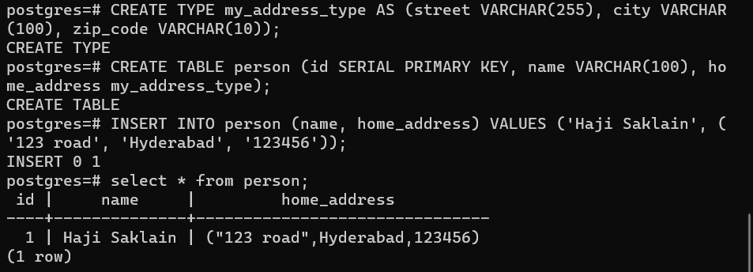{width="6.268055555555556in"
height="2.2625in"}

**Custom Types:**

PostgreSQL allows the creation of custom types using the \`CREATE TYPE\`
statement.

CREATE TYPE mood AS ENUM (\'happy\', \'sad\', \'neutral\');

CREATE TABLE person_mood (id SERIAL PRIMARY KEY, name VARCHAR(100),
current_mood moods);

INSERT INTO person_mood (name, current_mood) VALUES (\'Alice\',
\'happy\');

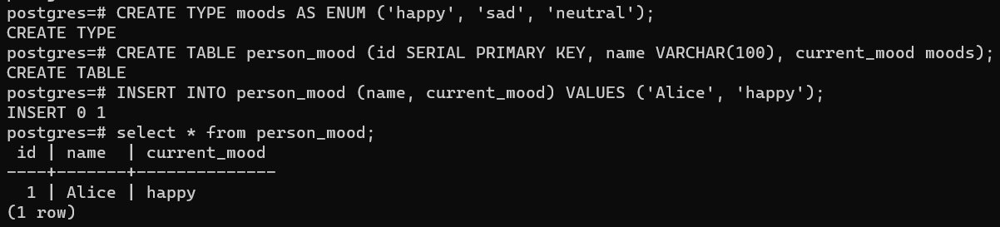{width="6.625in"
height="2.05in"}

**[Queries and Joins]{.underline}**

**SELECT Statement:**

The \`SELECT\` statement is used to retrieve data from one or more
tables. It is the most fundamental and commonly used SQL statement.

1.  Select all columns from the \"employees\" table

-   SELECT \* FROM employees;

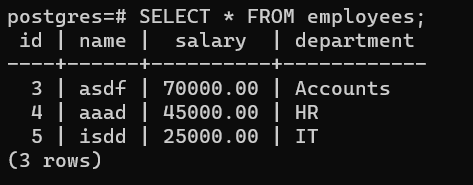{width="4.941666666666666in"
height="1.3916666666666666in"}

2.  Select specific columns

-   SELECT name, salary FROM employees;

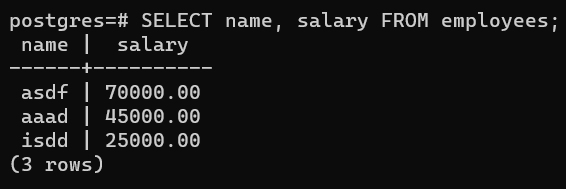{width="4.716666666666667in"
height="1.575in"}

3.  Use expressions and aliases

-   SELECT name, salary \* 1.1 AS increased_salary FROM employees;

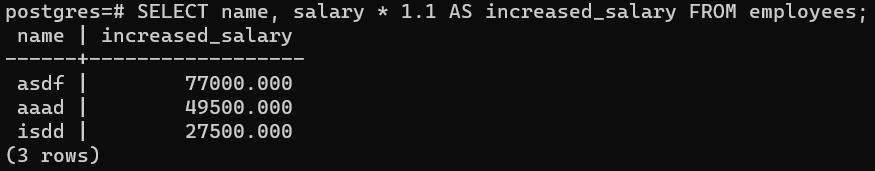{width="6.268055555555556in"
height="1.225in"}

**WHERE Clause:**

The \`WHERE\` clause is used to filter the rows returned by a query
based on a specified condition.

1.  Select employees with a salary greater than 50000

-   SELECT \* FROM employees WHERE salary \> 50000;

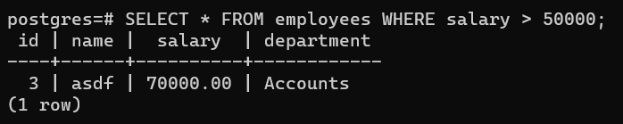{width="5.816666666666666in"
height="1.1583333333333334in"}

2.  Combine multiple conditions

-   SELECT \* FROM employees WHERE salary \> 50000 AND department =
    \'IT\';

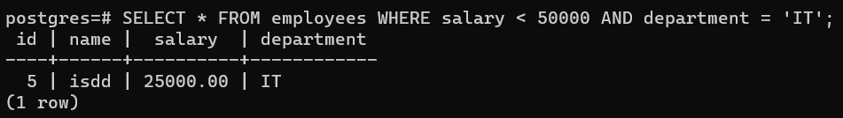{width="6.268055555555556in"
height="0.8833333333333333in"}

**[JOIN Operations (INNER, LEFT, RIGHT, FULL):]{.underline}**

Joins are used to combine rows from two or more tables based on related
columns.

Firstly create two tables and insert the values in them.

CREATE TABLE employees (employee_id SERIAL PRIMARY KEY, name
VARCHAR(100), department_id INTEGER);

INSERT INTO employees (name, department_id) VALUES (\'haji\', 1),
(\'saklain\', 2), (\'haji saklain\', 1), (\'saklain haji\', 3);

CREATE TABLE departments (department_id SERIAL PRIMARY KEY,
department_name VARCHAR(100));

INSERT INTO departments (department_name) VALUES
(\'HR\'),(\'IT\'),(\'Finance\');

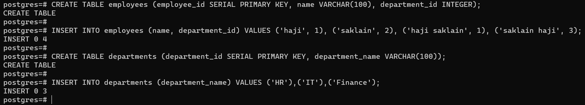{width="6.871211723534558in"
height="2.0375in"}

**INNER JOIN:**

Retrieve data where there is a match in both tables

SELECT employees.name, departments.department_name FROM employees INNER
JOIN departments ON employees.department_id = departments.department_id;

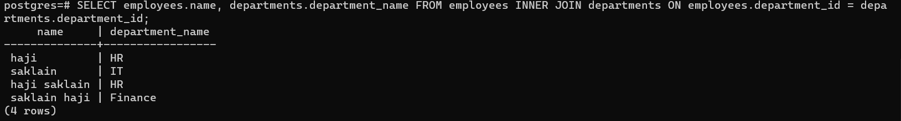{width="6.696527777777778in"
height="1.2575754593175854in"}

**LEFT JOIN:**

Retrieve all rows from the left table and the matched rows from the
right table

SELECT employees.name, departments.department_name FROM employees LEFT
JOIN departments ON employees.department_id = departments.department_id;

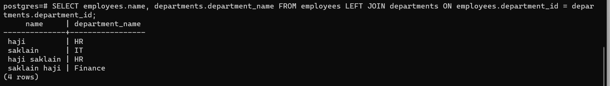{width="6.727272528433946in"
height="1.5in"}

**RIGHT JOIN:**

Retrieve all rows from the right table and the matched rows from the
left table

SELECT employees.name, departments.department_name FROM employees RIGHT
JOIN departments ON employees.department_id = departments.department_id;

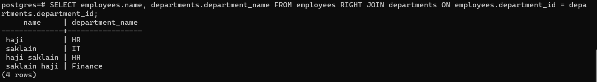{width="6.795138888888889in"
height="1.4848490813648294in"}

**FULL JOIN:**

Retrieve all rows when there is a match in either table

SELECT employees.name, departments.department_name FROM employees FULL
JOIN departments ON employees.department_id = departments.department_id;

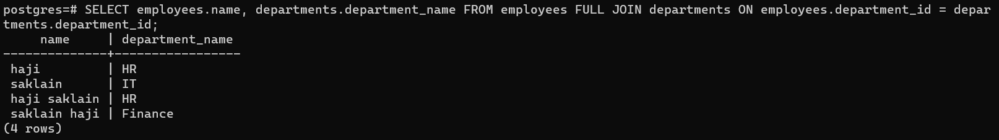{width="6.893939195100613in"
height="1.4166666666666667in"}

**[GROUP BY and HAVING:]{.underline}**

Create employees table

CREATE TABLE employees (employee_id SERIAL PRIMARY KEY, name
VARCHAR(100), salary DECIMAL(10, 2), department_id INTEGER);

INSERT INTO employees (name, salary, department_id) VALUES (\'qwerty\',
50000.00, 1), (\'Haji Saklain\', 60000.50, 2), (\'Haji\', 55000.75, 1),
(\'Saklain\', 70000.25, 3), (\'asdf\', 60000.00, 2), (\'Saklain Haji\',
65000.80, 1);

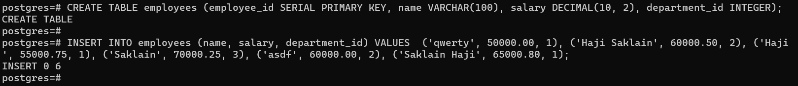{width="6.825757874015748in"
height="1.5611111111111111in"}

The **\`GROUP BY\`** clause is used to group rows that have the same
values in specified columns into aggregated results.

1.  Calculate the average salary for each department

SELECT department_id, AVG(salary) AS avg_salary FROM employees GROUP BY
department_id;

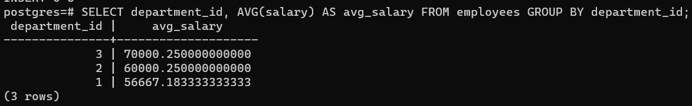{width="6.597916666666666in"
height="1.2121216097987753in"}

2.  Count the number of employees in each department

SELECT department_id, COUNT(\*) AS employee_count FROM employees GROUP
BY department_id;

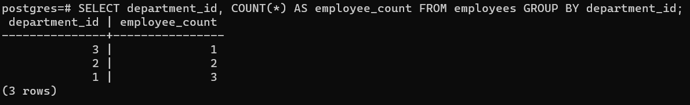{width="6.526447944006999in"
height="1.236862423447069in"}

The **\`HAVING\`** clause filters the results of the grouped data based
on specified conditions.

1.  Find departments with an average salary greater than 55000

SELECT department_id, AVG(salary) AS avg_salary FROM employees GROUP BY
department_id HAVING AVG(salary) \> 55000;

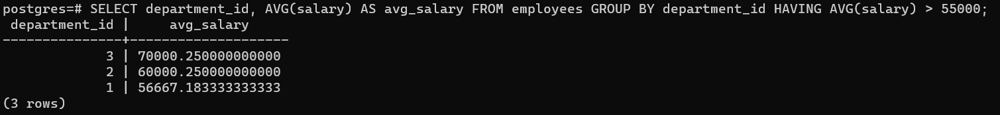{width="6.833333333333333in"
height="1.2284722222222222in"}

2.  Find departments with more than 1 employee and an average salary
    greater than 55000

SELECT department_id, COUNT(\*) AS employee_count, AVG(salary) AS
avg_salary FROM employees GROUP BY department_id HAVING COUNT(\*) \> 1
AND AVG(salary) \> 55000;

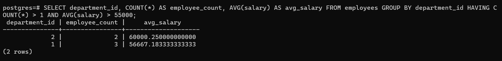{width="6.901388888888889in"
height="1.2272725284339459in"}
