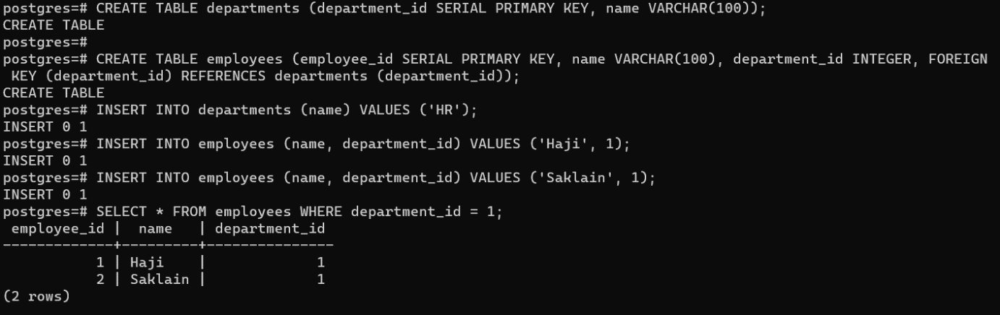

PostgreSQL Documentation
------------------------

Table of Contents

1.  Introduction

-   Overview of PostgreSQL

-   Key Features

2.  Installation

-   System Requirements

-   Download and Install PostgreSQL

-   Configuration Options

3.  Getting Started

-   Connecting to PostgreSQL

-   Creating a Database

-   Creating Tables

-   Basic SQL Commands

4.  Data Types

-   Numeric Types

-   Character Types

-   Date and Time Types

-   Composite Type

-   Custom Types

5.  Queries and Joins

-   SELECT Statement

-   WHERE Clause

-   JOIN Operations (INNER,LEFT,RIGHT,FULL)

-   GROUP BY and HAVING
  
6. Primary Key
   
7. Foreign Key

8. Constraints

9. Adding, Updating, and Deleting Records

10. Relationships

11.  Indexes and Optimization

-   Creating Indexes

-   Query Optimization Techniques

-   EXPLAIN Statement

12.  Transactions

-   ACID Properties

-   BEGIN,COMMIT,ROLLBACK Statements

-   Savepoints

13.  Security

-   Authentication Methods

-   User and Role Management

-   Permissions and Privileges

14.  Backup and Restore

-   pg_dump and pg_restore

-   Continuous Archiving and Point-in-Time Recovery

15. Replication

-   Streaming Replication

-   Logical Replication

16. Tools and Utilities

-   pgAdmin (Graphical Administration Tool)

-   psql (Command-Line Interface)

-   Other Third-Party Tools

&nbsp;

**Overview of PostgreSQL**

-   PostgreSQL,often referred to as \"Postgres,\" is a powerful and
    open-source relational database management system (RDBMS). It is
    designed to store and manage large amounts of data securely and
    efficiently.

-   PostgreSQL is free and open-source,which means anyone can use,
    modify,and distribute it. This encourages a combined community
    contributing to its continuous improvement.

-   It follows the relational model,organizing data into tables with
    rows and columns. This setup helps connect different pieces of
    information easily.

-   PostgreSQL follows ACID principles(Atomicity,Consistency,
    Isolation,Durability) making sure that transactions are dependable
    and keep the database secure,even when there are errors or system
    failures.

-   PostgreSQL is powerful because users can easily customize it to fit
    their specific needs. They can define their data types,operators,
    and functions,making it flexible for different applications.

-   PostgreSQL uses MVCC to manage many transactions happening at the
    same time. This makes sure that many users can work with and change
    data at the same time without any problems.

&nbsp;

    
&nbsp;

**<u>Key Features</u>**

**Advanced Data Types:**

PostgreSQL can handle many different types of data,like arrays,
key-value pairs (hstore),JSON,and custom types. This makes it easy to
store and get different kinds of information efficiently.

**Extensive Indexing:**

PostgreSQL has different ways to organize data for quick searching,like
B-trees,hash indexes,and full-text indexes. Good indexing makes
searching for information faster,especially when dealing with lots of
data.

**Robust Transaction Support:**

PostgreSQL makes sure transactions are reliable by sticking to ACID
rules. This is good for applications where keeping data safe and correct
is really important.

**Scalability:**

PostgreSQL is made to handle more work in two ways: by adding more
servers sideways (horizontal scaling) or by making the current server
work better (vertical scaling).

**Foreign Data Wrappers (FDW):**

PostgreSQL helps you connect to and ask questions about data in other
databases or external sources easily. This is useful when data is spread
across many systems.

**Active Community and Support:**

PostgreSQL has a lively community of people who make the software
better. They regularly update it,fix bugs,and add new features. This
helps ensure that PostgreSQL remains a reliable and always improving
database system.

&nbsp;

&nbsp;

**Installation**

Installing PostgreSQL involves a few steps to ensure a smooth setup.

**System Requirements**

Before installing PostgreSQL make sure your system meets the following
requirements:

-   **Operating System:** PostgreSQL supports various operating systems,
    including Windows,macOS,and various flavors of Linux (e.g.,
    Ubuntu,CentOS).

-   **Processor:** A modern processor capable of handling the expected
    workload.

-   **RAM:** A minimum of 1 GB RAM is recommended,but more is better,
    especially for handling larger databases.

-   **Disk Space:** Allocate at least 100 MB for the PostgreSQL binaries
    and libraries. Additional space is required for your databases.

&nbsp;

&nbsp;

**Download and Install PostgreSQL**

**Windows:**

1.  Visit the official PostgreSQL download page

(https://www.postgresql.org/download/windows/).

2.  Download the installer suitable for your architecture (32-bit or
    64-bit).

3.  Run the installer and follow the on-screen instructions.

4.  During installation,you will be prompted to set a password for the
    default database superuser.

&nbsp;

**macOS:**

Use Homebrew to install PostgreSQL:

-   brew install postgresql

&nbsp;

**Linux (Ubuntu):**

1.  Update the package list: sudo apt-get update

> 

2\. Install PostgreSQL: sudo apt-get install postgresql

&nbsp;

&nbsp;

**Connecting to PostgreSQL**

To connect to PostgreSQL,you can use the \`psql\` command-line tool or
a graphical client like pgAdmin.

psql -h localhost -U your_username -d your_database

-   \`-h\`: Hostname,specify the server\’s address.

-   \`-U\`: User,provide your PostgreSQL username.

-   \`-d\`: Database,specify the name of the database you want to
    connect to.

You\’ll be prompted to enter your password. If you\’re connecting
locally and using the default settings,you might not need to provide a
password.

&nbsp;

**Creating a Database**

To create a new database,you can use the SQL command within \`psql\`.

SQL Command: CREATE DATABASE your_database;

&nbsp;

&nbsp;

**Creating Tables**

Creating tables involves defining the structure of your data by
specifying columns,data types,and constraints.

CREATE TABLE employees (id serial PRIMARY KEY,name VARCHAR(100),salary
DECIMAL(10,2));

-   \`id\`: Auto-incrementing primary key.

-   \`name\`: Variable character column for the employee\’s name.

-   \`salary\`: Decimal column for the employee\’s salary.

&nbsp;

&nbsp;

**Basic SQL Commands**

**SELECT Statement:**

Retrieve all columns from the employees table++

SELECT \* FROM employees;

&nbsp;

**RETRIEVE SPECIFIC COLUMNS**

SELECT name,salary FROM employees;

&nbsp;

**INSERT STATEMENT:**

INSERT INTO employees (name,salary) VALUES (\’John Doe\’,60000.00);

&nbsp;

**Filter results with a condition**

SELECT \* FROM employees WHERE salary \> 50000;

&nbsp;

**UPDATE Statement:**

UPDATE employees SET salary = 65000.00 WHERE name = \’John Doe\’;

&nbsp;

**DELETE Statement:**

DELETE FROM employees WHERE name = \’John Doe\’;

&nbsp;

&nbsp;

**Data Types**

In PostgreSQL,there are various data types that you can use to define
the characteristics of columns in your tables.

**Numeric Types:**

PostgreSQL supports various numeric types,including \`INTEGER\`,
\`DECIMAL\`,\`NUMERIC\`,\`REAL\`,and \`DOUBLE PRECISION\`.

CREATE TABLE numeric_example (integer_column INTEGER,decimal_column
DECIMAL(10,2),real_column REAL,double_precision_column DOUBLE
PRECISION);

INSERT INTO numeric_example VALUES (123,456.78,789.01,1234.5678);

&nbsp;

**Character Types:**

Character types include \`CHAR\`,\`VARCHAR\`,and \`TEXT\`

CREATE TABLE character_example (char_column CHAR(10),varchar_column
VARCHAR(255),text_column TEXT);

INSERT INTO character_example VALUES (\’abc\’,\’abcdefg\’,
\’abcdefghijklmnopqrstuvwxyz\’);

&nbsp;

**Date and Time Types:**

PostgreSQL provides several date and time types,including \`DATE\`,
\`TIME\`,\`TIMESTAMP\`,and \`INTERVAL\`

CREATE TABLE date_time_example (date_column DATE,time_column TIME,
timestamp_column TIMESTAMP,interval_column INTERVAL);

INSERT INTO date_time_example VALUES (\’2024-02-01\’,\’12:30:00\’,
\’2024-02-01 12:30:00\’,\’1 day 2 hours\’);

&nbsp;

**Composite Type:**

A composite type is a custom type composed of multiple fields.

CREATE TYPE my_address_type AS (street VARCHAR(255),city VARCHAR(100),
zip_code VARCHAR(10));

CREATE TABLE person (id SERIAL PRIMARY KEY,name VARCHAR(100),
home_address my_address_type);

INSERT INTO person (name,home_address) VALUES (\’Haji Saklain\’,(\’123
road\’,\’Hyderabad\’,\’123456\’));

&nbsp;

**Custom Types:**

PostgreSQL allows the creation of custom types using the \`CREATE TYPE\`
statement.

CREATE TYPE mood AS ENUM (\’happy\’,\’sad\’,\’neutral\’);

CREATE TABLE person_mood (id SERIAL PRIMARY KEY,name VARCHAR(100), current_mood moods);

INSERT INTO person_mood (name,current_mood) VALUES (\’Alice\’, \’happy\’);

&nbsp;

&nbsp;

**Queries and Joins**

**SELECT Statement:**

The \`SELECT\` statement is used to retrieve data from one or more
tables. It is the most fundamental and commonly used SQL statement.

1.  Select all columns from the \"employees\" table

-   SELECT \* FROM employees;

&nbsp;

2.  Select specific columns

-   SELECT name,salary FROM employees;

&nbsp;

3.  Use expressions and aliases

-   SELECT name,salary \* 1.1 AS increased_salary FROM employees;

&nbsp;

**WHERE Clause:**

The \`WHERE\` clause is used to filter the rows returned by a query
based on a specified condition.

1.  Select employees with a salary greater than 50000

-   SELECT \* FROM employees WHERE salary \> 50000;

&nbsp;

2.  Combine multiple conditions

-   SELECT \* FROM employees WHERE salary \> 50000 AND department =
    \’IT\’;

&nbsp;

&nbsp;

**JOIN Operations (INNER,LEFT,RIGHT,FULL):**

Joins are used to combine rows from two or more tables based on related
columns.

Firstly create two tables and insert the values in them.

CREATE TABLE employees (employee_id SERIAL PRIMARY KEY,name
VARCHAR(100),department_id INTEGER);

INSERT INTO employees (name,department_id) VALUES (\’haji\’,1),
(\’saklain\’,2),(\’haji saklain\’,1),(\’saklain haji\’,3);

CREATE TABLE departments (department_id SERIAL PRIMARY KEY,
department_name VARCHAR(100));

INSERT INTO departments (department_name) VALUES
(\’HR\’),(\’IT\’),(\’Finance\’);

&nbsp;

**INNER JOIN:**

Retrieve data where there is a match in both tables

SELECT employees.name,departments.department_name FROM employees INNER
JOIN departments ON employees.department_id = departments.department_id;

&nbsp;

**LEFT JOIN:**

Retrieve all rows from the left table and the matched rows from the
right table

SELECT employees.name,departments.department_name FROM employees LEFT
JOIN departments ON employees.department_id = departments.department_id;

&nbsp;

**RIGHT JOIN:**

Retrieve all rows from the right table and the matched rows from the
left table

SELECT employees.name,departments.department_name FROM employees RIGHT
JOIN departments ON employees.department_id = departments.department_id;

&nbsp;

**FULL JOIN:**

Retrieve all rows when there is a match in either table

SELECT employees.name,departments.department_name FROM employees FULL
JOIN departments ON employees.department_id = departments.department_id;

&nbsp;

&nbsp;

**GROUP BY and HAVING:**

Create employees table

CREATE TABLE employees (employee_id SERIAL PRIMARY KEY,name
VARCHAR(100),salary DECIMAL(10,2),department_id INTEGER);

INSERT INTO employees (name,salary,department_id) VALUES (\’qwerty\’,
50000.00,1),(\’Haji Saklain\’,60000.50,2),(\’Haji\’,55000.75,1),
(\’Saklain\’,70000.25,3),(\’asdf\’,60000.00,2),(\’Saklain Haji\’,
65000.80,1);

&nbsp;

The **\`GROUP BY\`** clause is used to group rows that have the same
values in specified columns into aggregated results.

1.  Calculate the average salary for each department

SELECT department_id,AVG(salary) AS avg_salary FROM employees GROUP BY
department_id;

&nbsp;

2.  Count the number of employees in each department

SELECT department_id,COUNT(\*) AS employee_count FROM employees GROUP
BY department_id;

&nbsp;

&nbsp;

The **\`HAVING\`** clause filters the results of the grouped data based
on specified conditions.

1.  Find departments with an average salary greater than 55000

SELECT department_id,AVG(salary) AS avg_salary FROM employees GROUP BY
department_id HAVING AVG(salary) \> 55000;

&nbsp;

2.  Find departments with more than 1 employee and an average salary
    greater than 55000

SELECT department_id,COUNT(\*) AS employee_count,AVG(salary) AS
avg_salary FROM employees GROUP BY department_id HAVING COUNT(\*) \> 1
AND AVG(salary) \> 55000;

&nbsp;

&nbsp;

**Primary Key**

A primary key is like a special column or group of columns in a table that helps each row be different. It makes sure the data is correct and follows the rules of the database.

**Creating a table with a primary key**

CREATE TABLE students (student\_id SERIAL PRIMARY KEY, name VARCHAR(100), age INT);

&nbsp;

**Inserting data with a primary key**

INSERT INTO students (name, age) VALUES ('haji', 25), ('saklain', 22);

&nbsp;

&nbsp;

**Constraints**

Constraints are like rules for columns in a table. They help make sure the data is correct and complete. PostgreSQL has different types of constraints such as NOT NULL, UNIQUE, CHECK, and PRIMARY KEY.

&nbsp;

Adding a UNIQUE constraint

ALTER TABLE students ADD CONSTRAINT unique\_name UNIQUE (name);

Adding a CHECK constraint

ALTER TABLE students ADD CONSTRAINT check\_age CHECK (age \>= 18);

&nbsp;

If you try to put in information with the same ID in a table that uses a primary key, it won't let you do it.

&nbsp;

&nbsp;

**Adding, Updating, and Deleting Records**

**Adding Records:**

**Inserting a single record**

INSERT INTO students (name, age) VALUES ('Alice Brown', 20);

**Inserting multiple records**

INSERT INTO students (name, age) VALUES ('Bob Johnson', 22), ('Eve White', 19);

&nbsp;

&nbsp;

**Updating Records:**

UPDATE students SET age = 21 WHERE name = 'Alice Brown';

&nbsp;

**Deleting Records:**

DELETE FROM students WHERE name = 'Bob Johnson';

&nbsp;

&nbsp;

**Foreign Key**

A foreign key is like a connection between information in two tables. It makes sure that the data in one table corresponds to the data in another table.

Creating a table with a foreign key

CREATE TABLE courses (course\_id SERIAL PRIMARY KEY, course\_name VARCHAR(100), instructor VARCHAR(100));

ALTER TABLE students ADD COLUMN course\_id INT, ADD CONSTRAINT fk\_course FOREIGN KEY (course\_id) REFERENCES courses (course\_id);

&nbsp;

&nbsp;

**Adding Relationships Between Tables**

Inserting data with foreign key relationships

INSERT INTO students (name, age, course\_id) VALUES ('fkvf', 33, 8);

&nbsp;

**Query to fetch data with a JOIN**

SELECT students.name, courses.course\_name FROM students JOIN courses ON students.course\_id = courses.course\_id;

&nbsp;

&nbsp;

**Creating Indexes:**

Indexes in PostgreSQL are like organized lists that help the database
find specific information faster. They work by sorting and storing data
based on certain columns, making it quicker for the database to locate
and retrieve the desired rows when you run a query. So, they basically
speed up the process of fetching data from the database.

CREATE INDEX index_name ON table_name (column_name);

Let\'s consider a example with a table named \`employees\`:

CREATE TABLE employees (emp_id SERIAL PRIMARY KEY, first_name
VARCHAR(50), last_name VARCHAR(50),n department VARCHAR(50), salary
INTEGER);

Now, let\'s create an index on the \`department\` column:

CREATE INDEX idx_department ON employees (department);

&nbsp;

&nbsp;

**Query Optimization Techniques:**

PostgreSQL offers various techniques to optimize queries for better
performance:

1\. Proper Indexing: Create indexes on columns frequently used in WHERE
clauses, JOIN conditions, or ORDER BY clauses.

&nbsp;

2\. Using EXPLAIN: Analyze the execution plan of a query using the
EXPLAIN statement to identify potential bottlenecks and optimize the
query accordingly.

&nbsp;

3\. Query Rewriting: Rewrite complex queries to simplify them and
improve their performance.

&nbsp;

4\. Join Strategies: Choose appropriate join strategies (e.g., nested
loop, hash join, merge join) based on the size and characteristics of
the tables involved.

&nbsp;

5\. Avoiding Unnecessary Functions: Avoid using functions in WHERE
clauses that prevent the use of indexes.

&nbsp;

6\. Partitioning: Partition large tables to improve query performance by
splitting them into smaller, more manageable partitions.

&nbsp;

Let\'s take an example of a simple query optimization technique using
indexing:

Suppose we have the following query:

SELECT \* FROM employees WHERE department = \'IT\';

By creating an index on the \`department\` column as shown earlier,
PostgreSQL can quickly retrieve rows belonging to the \'IT\' department,
resulting in faster query execution.

&nbsp;

&nbsp;

**EXPLAIN Statement:**

The EXPLAIN statement is used to analyze the execution plan of a query
without actually executing it. It provides valuable insights into how
PostgreSQL processes the query and which indexes it uses. Here\'s the
syntax:

EXPLAIN \[ANALYZE\] \[VERBOSE\] \<query\>;

EXPLAIN SELECT \* FROM employees WHERE department = \'IT\';

The output of this EXPLAIN statement will show the query plan, including
details such as the type of scan used (sequential scan, index scan,
etc.), the tables involved, and any conditions applied.

By analyzing this output, you can determine whether the query is
utilizing indexes efficiently and identify any areas for optimization.

These techniques can significantly improve the performance of your
PostgreSQL queries, especially when dealing with large datasets and
complex queries.

&nbsp;

&nbsp;

**ACID Properties**

ACID stands for Atomicity, Consistency, Isolation, and Durability. These
properties ensure that database transactions are processed reliably.

1\. Atomicity: Atomicity ensures that either all operations within a
transaction are successfully completed, or none of them are. If any part
of the transaction fails, the entire transaction is rolled back.

2\. Consistency: Consistency ensures that the database remains in a
consistent state before and after the transaction. Transactions must
maintain all database constraints, including foreign keys, uniqueness,
etc.

3\. Isolation: Isolation ensures that the execution of transactions
concurrently doesn\'t interfere with each other. Each transaction should
appear to execute in isolation from other transactions, even though they
may be running concurrently.

4\. Durability: Durability guarantees that once a transaction is
committed, its changes are permanent and will survive system failures.

**BEGIN, COMMIT, ROLLBACK Statements**

These statements are used to control transactions in PostgreSQL.

1\. BEGIN: Starts a new transaction block.

2\. COMMIT: Saves all the changes made within the transaction to the
database.

3\. ROLLBACK: Aborts the current transaction, discarding any changes
made within it.

Suppose we have two tables: \`accounts\` and \`transactions\`.

CREATE TABLE accounts (account_id SERIAL PRIMARY KEY,account_name
VARCHAR(50), balance DECIMAL);

CREATE TABLE transactions ( transaction_id SERIAL PRIMARY KEY,
account_id INT REFERENCES accounts(account_id), amount DECIMAL,
transaction_type VARCHAR(10), transaction_date TIMESTAMP DEFAULT
CURRENT_TIMESTAMP);

&nbsp;

&nbsp;

**Savepoints**

Savepoints allow you to set points within a transaction to which you can
later roll back.

Syntax for creating a savepoint: SAVEPOINT savepoint_name;

-   Begin a new transaction

BEGIN;

-   Insert a new record into the accounts table

INSERT INTO accounts (account_name, balance) VALUES ('Haji Saklain',
1000);

-   Insert a new record into the transactions table

INSERT INTO transactions (account_id, amount, transaction_type) VALUES
(1, 500, \'deposit\');

-   Savepoint 1

SAVEPOINT sp1;

-   Insert another record into the transactions table

INSERT INTO transactions (account_id, amount, transaction_type) VALUES
(1, 300, \'withdrawal\');

-   Rollback to Savepoint 1

ROLLBACK TO SAVEPOINT sp1;

-   Commit the transaction

COMMIT;

-   We begin a new transaction with \`BEGIN\`.

-   We insert a record into the \`accounts\` table and another record
    into the \`transactions\` table.

-   We set a savepoint \`sp1\` and then insert another record into the
    \`transactions\` table.

-   We rollback to \`sp1\`, undoing the last transaction.

-   Finally, we commit the transaction, saving the changes to the
    database.

&nbsp;

&nbsp;

**Authentication Methods**

PostgreSQL supports various authentication methods to control access to
the database server.

These methods are defined in the \`pg_hba.conf\` file.

Some common authentication methods are:

-   trust: Allows the connection unconditionally.

-   password: Requires the client to provide a password for
    authentication.

-   md5: Requires the client to provide a password and uses MD5 hashing
    for secure transmission.

-   scram-sha-256: Secure Password Authentication mechanism based on the
    SCRAM protocol.

-   cert: Uses SSL client certificates for authentication.

You can configure these authentication methods at the host, database,
user, or IP level in the \`pg_hba.conf\` file.

&nbsp;

&nbsp;

**User and Role Management**

In PostgreSQL, roles are used to control access privileges and manage
user permissions. Users are simply roles with the ability to log in. You
can create, modify, and delete roles using SQL commands or the \`CREATE
ROLE\`, \`ALTER ROLE\`, and \`DROP ROLE\` statements.

Example of creating a new role:

CREATE ROLE myuser WITH LOGIN PASSWORD \'mypassword\';

This command creates a new role named \`myuser\` with the ability to log
in and sets the password to \`mypassword\`.

Example of modifying a role:

ALTER ROLE myuser WITH SUPERUSER;

This command grants superuser privileges to the \`myuser\` role.

Example of deleting a role:

DROP ROLE myuser;

This command deletes the \`myuser\` role from the database.

&nbsp;

&nbsp;

**Permissions and Privileges**

PostgreSQL uses a comprehensive system of permissions and privileges to
control access to database objects such as tables, views, and functions.
The main privileges include:

-   SELECT: Allows reading data from a table or view.

-   INSERT: Allows inserting data into a table.

-   UPDATE: Allows updating existing data in a table.

-   DELETE: Allows deleting data from a table.

-   USAGE: Allows using a schema, sequence, or function.

-   CREATE: Allows creating new objects within a schema.

-   ALTER: Allows altering existing objects.

-   DROP: Allows dropping objects.

-   GRANT: Allows granting privileges to other roles.

-   REVOKE: Allows revoking privileges from other roles.

You can grant and revoke privileges using the \`GRANT\` and \`REVOKE\`
statements.

Example of granting SELECT privilege on a table:

GRANT SELECT ON employees TO myuser;

This command grants the \`SELECT\` privilege on the \`employees\` table
to the \`myuser\` role.

Example of revoking INSERT privilege on a table:

REVOKE INSERT ON employees FROM myuser;

This command revokes the \`INSERT\` privilege on the \`employees\` table
from the \`myuser\` role.

&nbsp;

&nbsp;

**pg_dump and pg_restore**

pg_dump

pg_dump is a utility provided by PostgreSQL for backing up entire
databases or specific database objects.

It generates a SQL script that contains the SQL commands required to
recreate the database\'s schema and data.

Syntax: pg_dump -U username -d dbname \> backup.sql

pg_dump -U postgres -d mydatabase \> mydatabase_backup.sql

pg_restore:

\`pg_restore\` is used to restore databases from backups created by
\`pg_dump\`.

It executes the SQL commands contained in the backup file to recreate
the database\'s schema and populate it with data.

Syntax: pg_restore -U username -d dbname backup.sql

pg_restore -U postgres -d mydatabase mydatabase_backup.sql

&nbsp;

&nbsp;

**Continuous Archiving and Point-in-Time Recovery:**

&nbsp;

**Continuous Archiving (WAL Archiving):**

PostgreSQL\'s continuous archiving feature allows you to continuously
archive the Write-Ahead Log (WAL) files to external storage.

This enables point-in-time recovery and provides additional protection
against data loss.

**Configuration in \`postgresql.conf\`:**

archive_mode = on

archive_command = \'cp %p /path/to/archive/%f\'

archive_mode = on

archive_command = \'cp %p /var/lib/postgresql/12/main/archive/%f\'

Here, \`%p\` represents the path of the WAL file, and \`%f\` represents
the filename of the WAL file.

Point-in-Time Recovery (PITR):

Point-in-time recovery allows you to restore a PostgreSQL database to a
specific point in time by applying the archived WAL segments.

Steps:

1\. Restore a base backup using \`pg_restore\`.

2\. Apply WAL segments using the \`restore_command\` in
\`recovery.conf\`.

Example

-   \`recovery.conf\`

restore_command = \'cp /path/to/archive/%f %p\'

recovery_target_time = \'YYYY-MM-DD HH:MI:SS\'

-   'restore_command'

restore_command = \'cp /var/lib/postgresql/12/main/archive/%f %p\'

recovery_target_time = \'2024-02-06 12:00:00\'

\`\`\`

\- After setting up \`recovery.conf\`, start PostgreSQL with \`pg_ctl
start\`.

&nbsp;

**Streaming Replication**

Streaming replication is a built-in replication feature in PostgreSQL
that provides high availability and read scalability by replicating
changes from a primary (master) database to one or more standby servers.
It operates at the physical level, replicating the entire data files
(blocks) from the primary to the standby servers.

&nbsp;

**How Streaming Replication Works**

1\. Primary Server :

The primary server continuously writes changes to its write-ahead log
(WAL) files, which contain a record of all modifications to the
database.

A background process called the WAL sender sends WAL segments to each
standby server.

2\. Standby Servers:

Standby servers receive the WAL segments from the primary server and
apply them to their own data files.

Standby servers operate in hot standby mode, allowing read-only queries
to be executed against them.

**Setting up Streaming Replication**

1\. Configure Primary Server:

Enable WAL archiving in \`postgresql.conf\`:

wal_level = replica

archive_mode = on

archive_command = \'cp %p /path/to/archive/%f\'

-Set up \`pg_hba.conf\` to allow replication connections.

2\. Create Standby Server:

Take a base backup of the primary server:

pg_basebackup -h primary_host -D /path/to/data_directory -U
replication_role -P -X stream

Create a recovery configuration file (\`recovery.conf\`) in the
standby\'s data directory:

standby_mode = \'on\'

primary_conninfo = \'host=primary_host port=5432 user=replication_role\'

restore_command = \'cp /path/to/archive/%f %p\'

Start the standby server with \`pg_ctl start\`.

Example: we have a primary server with a table \`employees\`:

CREATE TABLE employees (id SERIAL PRIMARY KEY, name VARCHAR(100),
department VARCHAR(100));

We configure streaming replication between the primary server (host:
\`primary_host\`) and a standby server (host: \`standby_host\`). Any
changes made to the \`employees\` table on the primary server will be
replicated to the standby server.

**Logical Replication:**

Logical replication is another method of replication in PostgreSQL that
operates at a higher level of abstraction compared to streaming
replication. Instead of replicating physical changes to data files,
logical replication replicates changes at the logical level (e.g.,
individual rows, tables, or databases).

**How Logical Replication Works:**

1\. Publication and Subscription:

The primary server publishes changes to specific tables or databases
using publications.

Standby servers subscribe to these publications to receive and apply the
changes.

2\. Replication Slots:

\- Replication slots are used to keep track of the replication progress
on standby servers and ensure that changes are not discarded before
being applied.

3\. Decoding and Applying Changes:

Changes made to the published tables are captured and decoded into a
logical replication stream.

Standby servers apply these changes to their own tables.

&nbsp;

&nbsp;

**Setting up Logical Replication:**

1.  Configure Primary Server:

Enable \`wal_level\` and \`max_replication_slots\` in
\`postgresql.conf\`.

2.  Create Publication:

Create a publication for the tables to be replicated:

CREATE PUBLICATION pub_name FOR TABLE table_name;

3.  Create Standby Server:

Create a replication slot on the standby server:

SELECT \* FROM pg_create_logical_replication_slot(\'slot_name\',
\'pgoutput\');

4.  Subscribe to the publication

CREATE SUBSCRIPTION sub_name CONNECTION \'host=primary_host
dbname=primary_db\' PUBLICATION pub_name;

&nbsp;

Example:

Let\'s continue with the previous example of the \`employees\` table. We
configure logical replication to replicate changes made to the
\`employees\` table from the primary server (host: \`primary_host\`) to
the standby server (host: \`standby_host\`).

Create a publication for the employees table

CREATE PUBLICATION pub_employees FOR TABLE employees;

Create a replication slot on the standby server

SELECT \* FROM pg_create_logical_replication_slot(\'slot_employees\',
\'pgoutput\');

Subscribe to the publication on the standby server

CREATE SUBSCRIPTION sub_employees CONNECTION \'host=primary_host
dbname=primary_db\' PUBLICATION pub_employees;

Now, any changes made to the \`employees\` table on the primary server
will be replicated to the standby server using logical replication.

&nbsp;

&nbsp;

**Tools and Utilities**

&nbsp;

**pgAdmin** (Graphical Administration Tool):

pgAdmin is a popular open-source graphical administration tool for
PostgreSQL. It provides a user-friendly interface for managing
databases, executing queries, and performing various administrative
tasks. Here\'s an overview of some key features:

Database Connection: pgAdmin allows you to connect to PostgreSQL
databases by providing connection parameters such as host, port,
username, and password.

Database Object Management: You can browse and manage database objects
such as tables, views, indexes, functions, triggers, and schemas.

Query Tool: pgAdmin includes a query tool that allows you to execute SQL
queries and view query results. You can also save and load query files.

Data Import/Export: pgAdmin provides tools for importing and exporting
data to and from PostgreSQL databases in various formats such as CSV,
SQL, and Excel.

Server Monitoring: You can monitor server activity, view server logs,
and analyze server performance using pgAdmin\'s monitoring features.

Here\'s a basic example of how to connect to a PostgreSQL database using
pgAdmin and execute a simple query:

1\. Launch pgAdmin and connect to your PostgreSQL server.

2\. Navigate to the \"Query Tool\" tab.

3\. Write a SQL query,

for example:

4\. Click the \"Execute\" button to run the query and view the results.

&nbsp;

&nbsp;

**psql** (Command-Line Interface):

psql is the command-line interface for PostgreSQL. It allows you to
interactively execute SQL queries, manage databases, and perform
administrative tasks directly from the terminal.

Here are some key features of psql:

Interactive Shell: psql provides an interactive shell where you can
execute SQL commands, view query results, and manage PostgreSQL
databases.

Command-Line Options: psql supports various command-line options for
specifying connection parameters, formatting query results, and
controlling behavior.

Meta-Commands: psql supports meta-commands, which are commands that are
processed by psql itself rather than being sent to the PostgreSQL
server. Meta-commands are preceded by a backslash (\\).

Output Formatting: psql allows you to control the formatting of query
results using options such as \`\\x\` for expanded display mode and
\`\\t\` for toggling the output format between aligned and unaligned.

Here\'s an example of how to connect to a PostgreSQL database using psql
and execute a simple query:

1\. Open a terminal window.

2\. Run the following command to connect to your PostgreSQL database:

psql -h localhost -U username -d dbname

Replace \`localhost\` with the hostname or IP address of your PostgreSQL
server, \`username\` with your PostgreSQL username, and \`dbname\` with
the name of your database.

3\. Enter your password when prompted.

4\. Once connected, you can execute SQL queries directly in the psql
shell,

&nbsp;

&nbsp;

**Other Third-Party Tools:**

In addition to pgAdmin and psql, there are numerous third-party tools
available for PostgreSQL administration, monitoring, performance tuning,
and development. Here are some examples:

pgBadger: pgBadger is a PostgreSQL log analyzer that generates detailed
reports from PostgreSQL log files, helping you identify performance
bottlenecks and optimize your database configuration.

pgDash: pgDash is a comprehensive monitoring solution for PostgreSQL
that provides real-time insights into database performance, query
execution, and server health.

pg_repack: pg_repack is a PostgreSQL extension that allows you to
reorganize tables and indexes without blocking write operations, helping
you reclaim disk space and improve query performance.

These third-party tools offer additional functionality and customization
options beyond what is provided by pgAdmin and psql, making them
valuable additions to your PostgreSQL toolbox.

Overall, PostgreSQL offers a rich ecosystem of tools and utilities for
managing and optimizing databases, allowing you to choose the ones that
best fit your workflow and requirements.

